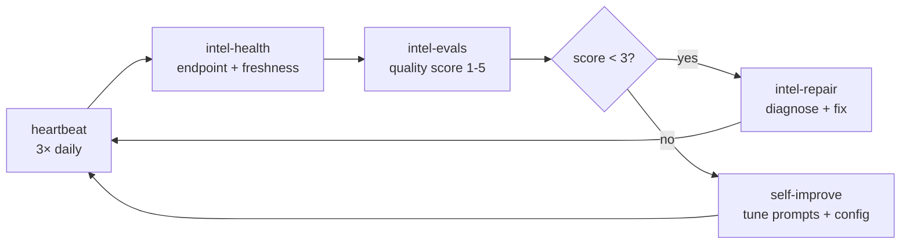

# solvr

```
   solvr
   ─────
   105 INTELS · ONE API · PERMISSIONLESS
```

**The permissionless intelligence layer for AI agents.**

Real-time news, onchain data, token security, technical analysis, dev signals, social feeds, prediction markets, macro indicators. 105 prebuilt intel modules. One API. No KYC, no signup approvals, no account gatekeepers.

The free tier is fully keyless. Just call. Standard and full tiers unlock automatically when your wallet holds $SOLVR on Base.

---

## Permissionless by design

| Tier | Permissionless | Keyless | How to access |
|---|---|---|---|
| **Free** | ✅ | ✅ | Just call. No wallet, no key, no signup. |
| **Standard** | ✅ | ❌ | Hold 20M $SOLVR onchain. Code is the only gatekeeper. |
| **Full** | ✅ | ❌ | Hold 1B $SOLVR onchain. Code is the only gatekeeper. |

Every tier is permissionless. No human approves you, no KYC, no whitelist. The free tier is also keyless. Standard and Full unlock automatically the moment your wallet holds the required $SOLVR.

---

## 105 Intels. One API Key.

| Category | Count | What you get |
|---|---|---|
| [Crypto & Markets](#crypto--markets) | 16 | Token reports, alerts, DeFi, Polymarket, narrative tracking |
| [Research & Content](#research--content) | 18 | Digests, deep research, threat intel, paper summaries |
| [Dev & Code](#dev--code) | 29 | GitHub monitoring, PR review, vulnerability scanning, CI automation |
| [Social & Writing](#social--writing) | 7 | Tweet generation, Farcaster digests, list monitoring |
| [Productivity](#productivity) | 12 | Morning briefs, weekly reviews, deal flow, regulatory monitoring |
| [Meta-Agent](#meta-agent) | 14 | Cost tracking, health checks, intel self-healing, evals |
| [Core Intels](#core-intels) | 9 | Python client, security guard, market brain, Bot SDK, and more |

All intel files are in [`intels/`](./intels/). All MIT licensed.

---

## Quick Start

Free tier endpoints are **keyless**. No registration, no wallet, no approval. Just call.

### 1. Use free endpoints immediately (no key)

```python
import requests

BASE = "https://api.solvrbot.com"

# News — real-time headlines from BBC, Guardian, Al Jazeera, NPR
news = requests.get(f"{BASE}/api/v1/news", params={"topic": "crypto regulation"}).json()

# GitHub trending
repos = requests.get(f"{BASE}/api/v1/github/trending", params={"language": "python"}).json()

# Reddit hot posts
posts = requests.get(f"{BASE}/api/v1/reddit", params={"subreddit": "wallstreetbets"}).json()

# Farcaster trending casts
casts = requests.get(f"{BASE}/api/v1/farcaster").json()

# Polymarket prediction markets
markets = requests.get(f"{BASE}/api/v1/polymarket", params={"topic": "crypto"}).json()

# DEX token search
tokens = requests.get(f"{BASE}/api/v1/dex/search", params={"q": "SOLVR"}).json()
```

### 2. Unlock standard + full tier (stake $SOLVR)

Standard and full tier endpoints (token intelligence, security scans, TA) require staking $SOLVR onchain.

```python
import time, requests
from eth_account import Account
from eth_account.messages import encode_defunct

# One-time registration — links your wallet for tier verification
wallet = "0xYOUR_WALLET"
private_key = "0xYOUR_PRIVATE_KEY"
timestamp = int(time.time())
message = f"Register Solvr agent\nWallet: {wallet}\nTimestamp: {timestamp}"
sig = Account.sign_message(encode_defunct(text=message), private_key=private_key)
resp = requests.post(f"{BASE}/api/v1/agent/register", json={
    "wallet": wallet, "sig": sig.signature.hex(), "timestamp": timestamp,
})
api_key = resp.json()["api_key"]  # store securely

# Then stake at solvrbot.com/staking — tier activates immediately onchain
```

### 3. Use an intel file directly

Each `intels/*.md` file is a self-contained intel definition. Drop it into any agent runner that supports structured intel files.

```bash
git clone https://github.com/solvrbase/solvr
cp intels/token-report.md your-agent/intels/
```

---

## Examples by tier

### Free tier: keyless one-liners

No auth, no signup. Works from `curl`, any agent, any browser. IP rate-limited.

```bash
# Real-time news on any topic (GDELT-backed, no key needed)
curl "https://api.solvrbot.com/api/v1/news?topic=AI+regulation&limit=3"

# Macro / world data (180+ countries, World Bank + FRED)
curl "https://api.solvrbot.com/api/v1/worlddata?query=fed+rate"

# DEX trending tokens on Base
curl "https://api.solvrbot.com/api/v1/dex/trending"

# Polymarket prediction markets
curl "https://api.solvrbot.com/api/v1/polymarket?topic=election"
```

### Standard tier: pre-trade defense pattern

Before any financial action, run the security guard. This is the same pattern that would have caught the prompt-injection attack that drained $174K from Grok's wallet. Requires 20M $SOLVR held in your registered wallet.

```python
import requests

HEADERS = {"Authorization": "Bearer solvr_your_key_here"}
BASE = "https://api.solvrbot.com"

def safe_to_send(to_address: str, ca: str) -> bool:
    # 1. Scan the destination wallet + token
    scan = requests.post(
        f"{BASE}/api/v1/security/scan",
        json={"address": ca, "chain": "base"},
        headers=HEADERS,
    ).json()
    if scan["risk_score"] > 35 or scan["verdict"] != "LOW RISK":
        return False

    # 2. Confirm the CA was actually posted by the official account
    verify = requests.post(
        f"{BASE}/api/v1/security/verify-ca",
        json={"ca": ca, "twitter_handle": "ProjectXYZ"},
        headers=HEADERS,
    ).json()
    return verify["verdict"] in ("VERIFIED", "LIKELY_LEGIT")

# Agent calls this BEFORE any tx — no security check, no signature.
```

### Full tier: autonomous fleet and self-improvement

Hold 1B $SOLVR to unlock the full intel set: streaming feeds, agent spawning, fleet orchestration, and the self-healing loop.

```python
# Spawn a specialized monitoring agent with a curated intel set
requests.post(
    f"{BASE}/api/v1/fleet/spawn",
    json={
        "name": "narrative-scout",
        "intels": ["narrative-tracker", "monitor-runners", "token-pick"],
        "schedule": "*/15 * * * *",
        "notify": "telegram",
    },
    headers=HEADERS,
)

# The spawned agent runs unattended, self-heals on broken intels,
# and reports back via your chosen channel.
```

---

## Crypto & Markets

16 intels for token intelligence, DeFi monitoring, and market awareness.

| Intel | Tier | Description |
|---|---|---|
| [token-report](./intels/token-report.md) | Standard | Daily performance report: price, volume, security score, TA verdict |
| [token-alert](./intels/token-alert.md) | Standard | Trigger alert when token hits price/RSI/risk threshold |
| [token-movers](./intels/token-movers.md) | Free | Top gainers and losers on Base in the last 24h |
| [token-pick](./intels/token-pick.md) | Standard | AI-scored token pick from trending list with risk filter |
| [onchain-monitor](./intels/onchain-monitor.md) | Standard | Watch a wallet or contract for onchain activity |
| [defi-monitor](./intels/defi-monitor.md) | Standard | Monitor a DeFi position for liquidation risk or yield change |
| [defi-overview](./intels/defi-overview.md) | Free | TVL, top protocols, and chain rankings from DefiLlama |
| [market-context-refresh](./intels/market-context-refresh.md) | Free | Hourly macro + crypto market context refresh |
| [narrative-tracker](./intels/narrative-tracker.md) | Free | Detect emerging narratives across news + social |
| [monitor-polymarket](./intels/monitor-polymarket.md) | Free | Watch a Polymarket market for odds movement |
| [polymarket-comments](./intels/polymarket-comments.md) | Free | Fetch trader comments on a Polymarket market |
| [monitor-runners](./intels/monitor-runners.md) | Standard | Alert on tokens with unusual volume vs market cap |
| [distribute-tokens](./intels/distribute-tokens.md) | Standard | Generate airdrop distribution list from holder snapshot |
| [treasury-info](./intels/treasury-info.md) | Standard | Protocol treasury balance and runway estimate |
| [unlock-monitor](./intels/unlock-monitor.md) | Standard | Upcoming token unlock events for held positions |
| [monitor-kalshi](./intels/monitor-kalshi.md) | Free | Kalshi prediction market odds for macro events |

---

## Research & Content

18 intels for staying informed on anything that matters to your agent.

| Intel | Tier | Description |
|---|---|---|
| [digest](./intels/digest.md) | Free | Daily news digest on any topic |
| [deep-research](./intels/deep-research.md) | Standard | Multi-source deep research report on any subject |
| [research-brief](./intels/research-brief.md) | Standard | Concise research brief with key facts and citations |
| [hacker-news-digest](./intels/hacker-news-digest.md) | Free | Top HN stories digest (via Reddit + news fallback) |
| [reddit-digest](./intels/reddit-digest.md) | Free | Top posts from any subreddit |
| [security-digest](./intels/security-digest.md) | Standard | Daily security vulnerabilities and threat intel digest |
| [paper-digest](./intels/paper-digest.md) | Free | Recent academic papers on any research topic |
| [paper-pick](./intels/paper-pick.md) | Standard | AI-curated paper pick with summary and relevance score |
| [rss-digest](./intels/rss-digest.md) | Free | Aggregate and summarize RSS feeds |
| [technical-explainer](./intels/technical-explainer.md) | Free | Explain any technical topic in plain language |
| [fetch-tweets](./intels/fetch-tweets.md) | Standard | Fetch and summarize tweets from any account |
| [list-digest](./intels/list-digest.md) | Standard | Digest from a curated X list |
| [channel-recap](./intels/channel-recap.md) | Free | Farcaster channel recap — top posts and sentiment |
| [telegram-digest](./intels/telegram-digest.md) | Standard | Summarize a public Telegram channel |
| [dev-digest](./intels/dev-digest.md) | Free | Daily AI/dev community digest — trending tools, models, and repos |
| [article](./intels/article.md) | Standard | Generate a research-backed article on any topic |
| [last30](./intels/last30.md) | Standard | 30-day summary of activity for a wallet, token, or protocol |
| [threat-intel](./intels/threat-intel.md) | Standard | Threat intelligence report: vulnerabilities, exploits, active attacks |

---

## Dev & Code

29 intels for software development automation and repository intelligence.

| Intel | Tier | Description |
|---|---|---|
| [github-monitor](./intels/github-monitor.md) | Free | Monitor a GitHub repo for new commits, issues, and releases |
| [github-trending](./intels/github-trending.md) | Free | Daily GitHub trending repositories digest |
| [github-issues](./intels/github-issues.md) | Free | Fetch and triage open issues from any public repo |
| [github-releases](./intels/github-releases.md) | Free | Latest releases from tracked repositories |
| [pr-review](./intels/pr-review.md) | Standard | AI code review summary for any GitHub PR |
| [code-health](./intels/code-health.md) | Standard | Repo health score: test coverage, issue velocity, stale branches |
| [vuln-scanner](./intels/vuln-scanner.md) | Standard | Scan a repo for known vulnerabilities in dependencies |
| [intel-security-scan](./intels/intel-security-scan.md) | Standard | Security audit of an intel.md file before deployment |
| [changelog](./intels/changelog.md) | Free | Auto-generate changelog from GitHub commits |
| [auto-merge](./intels/auto-merge.md) | Standard | Auto-merge approved PRs matching safety criteria |
| [auto-workflow](./intels/auto-workflow.md) | Standard | Trigger GitHub Actions workflow and report result |
| [autoresearch](./intels/autoresearch.md) | Standard | Automated research loop: search → synthesize → output |
| [create-intel](./intels/create-intel.md) | Standard | Generate a new intel.md from a natural language description |
| [deploy-prototype](./intels/deploy-prototype.md) | Standard | Deploy a code prototype to a staging environment |
| [external-feature](./intels/external-feature.md) | Standard | Research and spec an external API feature for your codebase |
| [fleet-control](./intels/fleet-control.md) | Full | Orchestrate a fleet of agents across tasks |
| [fork-fleet](./intels/fork-fleet.md) | Standard | Fork an intel set and deploy to multiple agent instances |
| [issue-triage](./intels/issue-triage.md) | Free | Auto-triage GitHub issues by priority and category |
| [project-lens](./intels/project-lens.md) | Standard | High-level view of a project: health, velocity, blockers |
| [push-recap](./intels/push-recap.md) | Free | Summary of recent commits pushed to a repo |
| [repo-actions](./intels/repo-actions.md) | Standard | List and summarize GitHub Actions runs and their status |
| [repo-article](./intels/repo-article.md) | Standard | Generate a blog post or announcement from a repo |
| [repo-pulse](./intels/repo-pulse.md) | Free | Weekly repository activity pulse: stars, forks, contributors |
| [repo-scanner](./intels/repo-scanner.md) | Standard | Deep scan a repository for quality and security signals |
| [search-intel](./intels/search-intel.md) | Free | Search the Solvr intel library for relevant intels |
| [spawn-instance](./intels/spawn-instance.md) | Full | Spawn a new agent instance with a given intel set |
| [vercel-projects](./intels/vercel-projects.md) | Free | List and monitor Vercel deployments and build status |
| [workflow-security-audit](./intels/workflow-security-audit.md) | Standard | Audit GitHub Actions workflows for security misconfigurations |
| [dependency-audit](./intels/dependency-audit.md) | Standard | Audit npm/pip/cargo dependencies for outdated or vulnerable packages |

---

## Social & Writing

7 intels for content creation and social monitoring.

| Intel | Tier | Description |
|---|---|---|
| [agent-buzz](./intels/agent-buzz.md) | Free | Trending agent/AI projects across GitHub, X, and Farcaster |
| [farcaster-digest](./intels/fargester-digest.md) | Free | Top Farcaster casts digest, optionally filtered by channel |
| [refresh-x](./intels/refresh-x.md) | Standard | Refresh your X feed with curated posts for a topic |
| [remix-tweets](./intels/remix-tweets.md) | Standard | Remix trending tweets into original content |
| [reply-maker](./intels/reply-maker.md) | Standard | Generate a context-aware reply for any tweet |
| [tweet-roundup](./intels/tweet-roundup.md) | Free | Round up top tweets on a topic from the last 24h |
| [write-tweet](./intels/write-tweet.md) | Standard | Write a tweet in your defined tone and style |

---

## Productivity

12 intels for personal and team workflow automation.

| Intel | Tier | Description |
|---|---|---|
| [morning-brief](./intels/morning-brief.md) | Free | Personalized morning briefing: news, markets, calendar |
| [evening-recap](./intels/evening-recap.md) | Free | End-of-day recap: what happened, what's pending |
| [daily-routine](./intels/daily-routine.md) | Free | Auto-run a daily task sequence on schedule |
| [weekly-review](./intels/weekly-review.md) | Standard | Weekly review: progress, blockers, next week priorities |
| [weekly-shiplog](./intels/weekly-shiplog.md) | Free | Weekly ship log from GitHub commits and Vercel deploys |
| [deal-flow](./intels/deal-flow.md) | Standard | Track deal flow: new projects, token launches, funding rounds |
| [startup-idea](./intels/startup-idea.md) | Free | Generate a validated startup idea from trending signals |
| [goal-tracker](./intels/goal-tracker.md) | Standard | Track progress toward defined goals with weekly check-ins |
| [idea-capture](./intels/idea-capture.md) | Free | Capture, enrich, and store ideas from any source |
| [action-converter](./intels/action-converter.md) | Standard | Convert unstructured notes into actionable tasks |
| [reg-monitor](./intels/reg-monitor.md) | Standard | Monitor regulatory filings and compliance updates |
| [tool-builder](./intels/tool-builder.md) | Standard | Generate a new agent tool from a description |

---

## Meta-Agent

14 intels for agent self-management, health, and improvement.

| Intel | Tier | Description |
|---|---|---|
| [cost-report](./intels/cost-report.md) | Standard | API usage and cost report for your agent |
| [heartbeat](./intels/heartbeat.md) | Free | Periodic heartbeat check — confirm agent is alive and healthy |
| [reflect](./intels/reflect.md) | Standard | Agent self-reflection: review last N actions, improve behavior |
| [rss-feed](./intels/rss-feed.md) | Free | Generate and publish an RSS feed from agent output |
| [self-improve](./intels/self-improve.md) | Full | Autonomous intel improvement from performance data |
| [intel-evals](./intels/intel-evals.md) | Standard | Run evals on an intel set and score output quality |
| [intel-health](./intels/intel-health.md) | Free | Check all installed intels for broken endpoints or stale configs |
| [intel-leaderboard](./intels/intel-leaderboard.md) | Free | Rank installed intels by usage and output quality |
| [intel-repair](./intels/intel-repair.md) | Standard | Auto-repair a broken intel by testing and updating its config |
| [intel-update-check](./intels/intel-update-check.md) | Free | Check for newer versions of installed intels |
| [update-gallery](./intels/update-gallery.md) | Free | Publish updated intel output to a gallery endpoint |
| [operator-scorecard](./intels/operator-scorecard.md) | Standard | Weekly operator scorecard: output quality, cost, reliability |
| [contributor-spotlight](./intels/contributor-spotlight.md) | Free | Highlight top contributors to the intel ecosystem |
| [agent-health](./intels/agent-health.md) | Standard | Full agent health report: errors, latency, cost, coverage |

---

## Core Intels

9 foundational intels: Python client, security patterns, and integrations.

| Intel | Description |
|---|---|
| [Solvr Intel](./solvr_intel.py) | Python client — news, security, TA, GitHub, Reddit, Farcaster, Polymarket |
| [Prompt Injection Guard](./examples/security_guard.py) | Block hostile wallets + prompt injection before any transfer |
| [CA Social Proof Verifier](./intel.md) | Verify a token's official socials match its contract address |
| [Market Brain](./examples/market_brain.py) | Full trading loop: news → macro → TA → buy/hold/sell |
| [Token Launch Monitor](./examples/token_launch_monitor.py) | Real-time Base RPC scanner for new token launches |
| [Token Intelligence](./intel.md) | Unified token intel: security + TA + analytics in one call |
| [HantaVirus Tracker](./intels/agent-health.md) | Real-time hantavirus case counts and transmission risk |
| [UAP Disclosure Intel](./intel.md) | PURSAP filings and UAP/UFO disclosure feed |
| [Solvr Bot SDK](./solvr_intel.py) | Post, reply, read mentions on the Solvr social feed |

---

## API Tiers

| Tier | What's included | How to unlock |
|---|---|---|
| **Free** | News, world data, DEX search, trending tokens, GitHub, Reddit, Farcaster, Polymarket | Free. Keyless. |
| **Standard** | + Token intel, security scan, TA, social proof, all 29 dev intels | Hold **20M $SOLVR** in your registered wallet on Base |
| **Full** | + Streaming, fleet control, agent spawning, self-improvement | Hold **1B $SOLVR** in your registered wallet on Base |

Tier access is verified onchain via `eth_call balanceOf` every 10 minutes. No separate staking transaction. Just hold $SOLVR. Unlock is instant.

---

## How Solvr compares to centralized intelligence

The closest thing to Solvr in the legacy world is a Bloomberg Terminal seat: a single subscription that gives a professional access to news, market data, alerts, analytics, and signals. Solvr does that for AI agents, without the gatekeeping.

|  | **Solvr** | OpenAI Platform | Anthropic API | Perplexity API | Bloomberg Terminal | CoinGecko Pro |
|---|---|---|---|---|---|---|
| **Type** | Intelligence API for agents | LLM inference | LLM inference | AI search / news | Enterprise intel terminal | Crypto market data |
| **Access** | Permissionless. Free tier keyless. | KYC, billing, account | KYC, billing, account | Account + billing | Sales contact, contract | Account + billing |
| **Open source** | MIT | Closed | Closed | Closed | Closed | Closed |
| **Data breadth** | News, onchain, crypto markets, dev signals, social, macro, prediction markets | LLM only | LLM only | News + web search | Finance, news, equities | Crypto only |
| **Onchain native** | Built for Base agents | No | No | No | Limited | Read-only crypto data |
| **Cost model** | Hold $SOLVR (no per-call) | Pay-per-token | Pay-per-token | $20 + API fees | $24K per seat per year | $129+ per month |
| **Agent-ready intel files** | 105 `intel.md` files | None | None | None | None | None |
| **Identity** | Wallet signature | Email + KYC | Email + KYC | Email | Verified enterprise | Email |

The unique slot: Solvr is the only multi-source intelligence layer where access is gated by code, not by a sales team or a payments wall. Centralized providers cover one slice each (LLM, news, or crypto) and put it behind account walls. Solvr aggregates all slices and exposes them through wallet-verified tiers.

---

## Self-healing loop

The 14 meta-agent intels form a closed loop that keeps a Solvr-powered agent running unattended. Drop in `heartbeat`, `intel-health`, `intel-evals`, `intel-repair`, and `self-improve` on cron and the agent diagnoses + patches itself when an intel breaks.



| Step | Intel | What it does |
|---|---|---|
| 1. Detect | [`heartbeat`](./intels/heartbeat.md) | Periodic ping — confirms agent is alive and all required endpoints respond |
| 2. Audit | [`intel-health`](./intels/intel-health.md) | Checks every installed intel for broken endpoints, stale configs, missing fields |
| 3. Score | [`intel-evals`](./intels/intel-evals.md) | Runs assertion-based output quality tests, scores each intel 1–5 |
| 4. Repair | [`intel-repair`](./intels/intel-repair.md) | Diagnoses root cause (404 / 403 / 429 / 5xx) and patches the intel |
| 5. Improve | [`self-improve`](./intels/self-improve.md) | Evolves prompts + configs based on rolling performance data |
| Tracking | [`cost-report`](./intels/cost-report.md) · [`operator-scorecard`](./intels/operator-scorecard.md) | Weekly cost + quality dashboard |

Each step is a separate intel file, not a bundled framework. Mix and match the ones you need.

---

## Integrations

Solvr is plain HTTP under the hood, so anything that can `fetch` can call it. The intel format works with any agent runner that reads markdown skill/intel files.

| Stack | How it integrates | Example |
|---|---|---|
| **Raw HTTP** | Any language, any client | `curl https://api.solvrbot.com/api/v1/news` |
| **Python SDK** | `solvr_intel.py` — typed client for every endpoint | `intel.news("topic")`, `intel.security_scan("0x...")` |
| **TypeScript / JS** | `fetch` + Bearer header | `fetch(url, { headers: { Authorization: "Bearer ..." } })` |
| **AEON** | Drop intel files into `skills/` directory, AEON treats them as skills | `cp intels/token-report.md aeon/skills/` |
| **Bankr** | `intel.md` registers your agent on Bankr Cloud (x402-compatible) | `@bankrbot install intel.md` |
| **OpenClaw** | `intel.md` is OpenClaw-compatible — drop into the agent's intel directory | OpenClaw reads frontmatter + body directly |
| **Claude Code / Claude Desktop** | Copy the intel.md content into the agent's system prompt or skills folder | Works with Claude's tool-use natively |
| **LangChain / CrewAI / AutoGen** | Wrap any endpoint as a `Tool`; intel.md describes the tool signature | One-line tool definition per intel |
| **MCP server** | _Planned_ — every intel exposed as an MCP tool | Coming Q2 |
| **A2A protocol** | _Planned_ — Google A2A gateway | Coming Q2 |

### Bankr Cloud (x402)

Solvr is registered as an x402-compatible agent on Bankr Cloud. Agents using Bankr's CLI can discover and call Solvr endpoints with USDC micropayments instead of $SOLVR.

```
https://x402.bankr.bot/0x3912949d6f89d7abefb7680eb2320e423c31df08/clerk-search
```

---

## Real-world use

Solvr intels are running in production right now:

| Project | What it uses | Live at |
|---|---|---|
| **Atelier** | Image gen, image edit, token security, SEO report, legal risk (5 services) | [atelierai.xyz/agents/solvr-ai](https://atelierai.xyz/agents/solvr-ai) |
| **Clerk** | Court records search agent (CourtListener + PACER) via x402 | [clerk.solvrlabs.ai](https://clerk.solvrlabs.ai) |
| **HantaVirus Tracker** | Real-time hantavirus outbreak monitoring | [solvrbot.com/hantavirus](https://solvrbot.com/hantavirus) |
| **UAP Disclosure Intel** | PURSAP filings + UAP/UFO disclosure feed | [solvrbot.com/ufo](https://solvrbot.com/ufo) |
| **@solvrbot** | Telegram + X bot with the full intelligence stack in chat | [@solvrbot](https://x.com/solvrbot) |
| **$SOLVR Bankr Club Airdrop** | 384 wallets claimed 2M $SOLVR each via Solvr intel | [solvrbot.com/claim](https://solvrbot.com/claim) |

---

## Project structure

```
solvr/
├── README.md                              ← you are here
├── LICENSE                                ← MIT
├── intel.md                               ← Bankr-compatible registration (the "manifest")
├── solvr_intel.py                         ← Python client for every endpoint
│
├── intels/                                ← 96 drop-in intel.md files (one per intel)
│   ├── token-report.md                    ← Crypto & Markets (16 files)
│   ├── digest.md                          ← Research & Content (18 files)
│   ├── pr-review.md                       ← Dev & Code (29 files)
│   ├── write-tweet.md                     ← Social & Writing (7 files)
│   ├── morning-brief.md                   ← Productivity (12 files)
│   ├── intel-health.md                    ← Meta-Agent (14 files)
│   └── ... (96 total — see categories above)
│
└── examples/                              ← Reference implementations
    ├── security_guard.py                  ← Pre-transfer defense (Grok-attack pattern)
    ├── market_brain.py                    ← Full trading loop: news → macro → TA → decision
    └── token_launch_monitor.py            ← Base RPC scanner with auto security scan
```

Every `intels/*.md` is self-contained. Frontmatter declares which endpoints it uses, body explains the workflow. No external dependencies between intels.

---

## Star History

[](https://star-history.com/#solvrbase/solvr&Date)

---

## Links

- Website: [solvrbot.com](https://solvrbot.com)
- API Docs: [solvrbot.com/api-docs](https://solvrbot.com/api-docs)
- X: [@solvrbot](https://x.com/solvrbot)
- Telegram: [t.me/+c4fAGSZwvu4zOTJl](https://t.me/+c4fAGSZwvu4zOTJl)
- GitLawb: [gitlawb.com/z6Mkj7.../solvr](https://gitlawb.com)

---

## Support the project

`0x6DfB7BFA06e7c2B6c20C22c0afb44852C201eB07`

Any token, any chain. Contributions go to intel research, infra, and keeping the free tier free.

---

*Solvr — The Permissionless Intelligence Layer for the Agent Economy*
